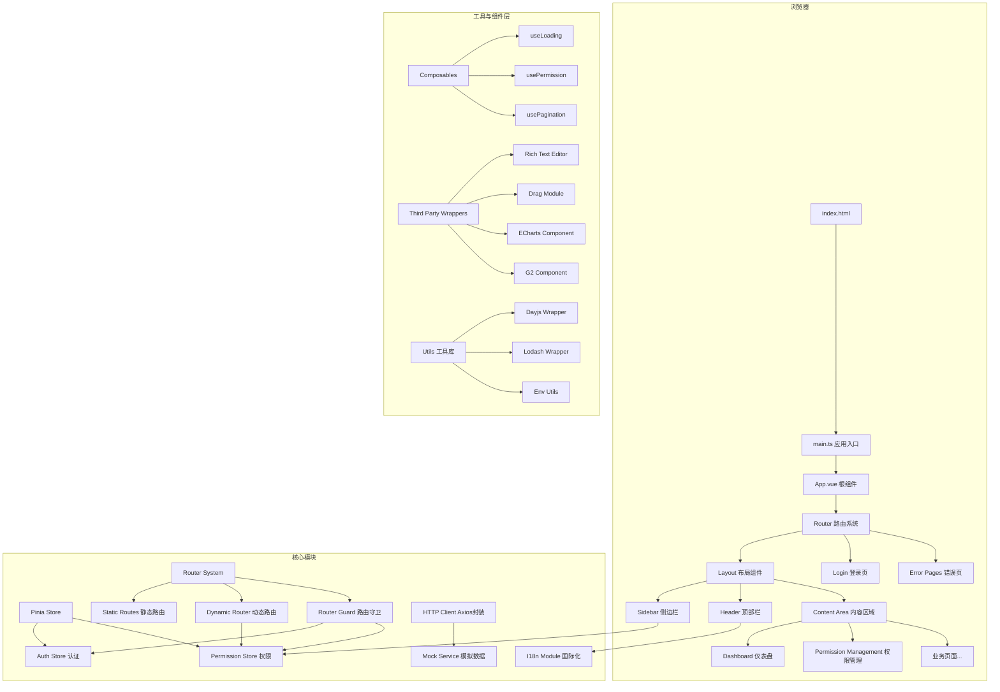
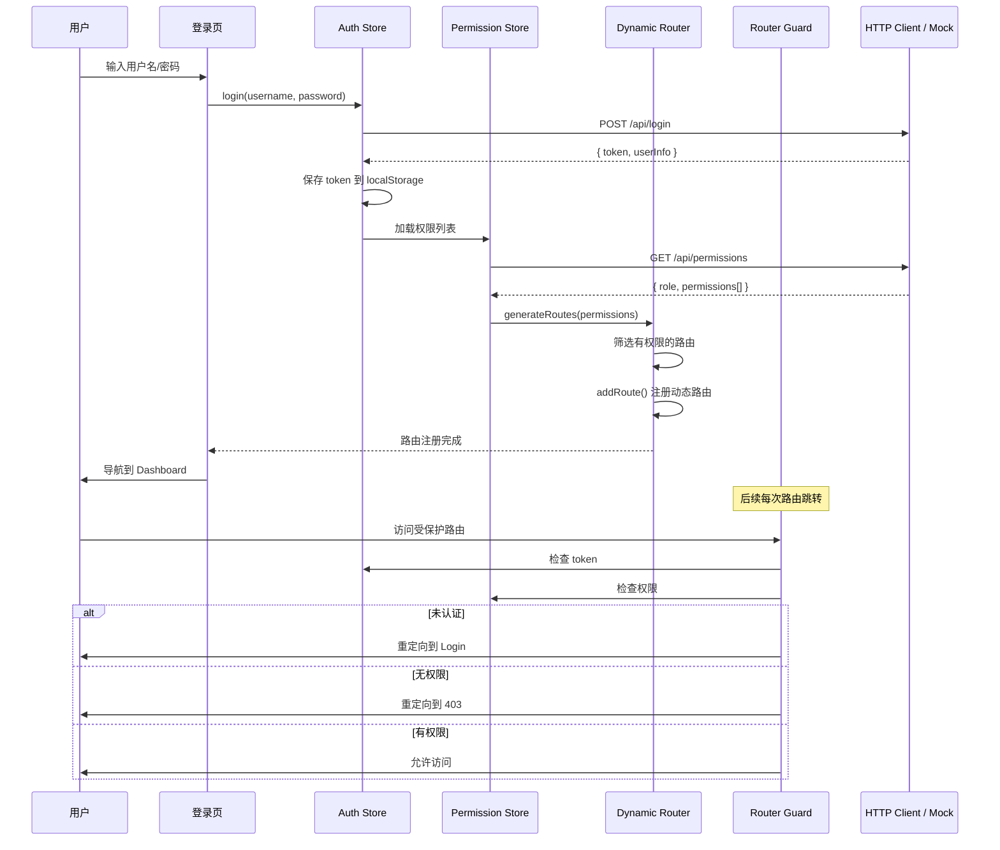

# 技术设计文档：Admin Dashboard

## 概述

本项目是一个基于 Vue 3 + TypeScript + Vite 8 技术栈的后台管理系统。系统采用 Naive UI 作为 UI 组件库，Pinia 进行状态管理，Vue Router 处理路由导航，vue-i18n 实现中英文国际化。核心功能包括：基于角色的动态路由注册与权限控制、标准后台管理布局（侧边栏多级菜单 + 顶部栏 + 内容区域）、登录认证、HTTP 请求封装（Axios + Mock）、第三方组件集成（富文本编辑器、拖拽排序、图表）、自定义 Composable Hooks 以及多环境变量配置。

### 设计目标

- 模块化架构：各功能模块职责清晰，低耦合高内聚
- 类型安全：全面使用 TypeScript 严格模式，所有接口和数据模型均有类型定义
- 可扩展性：路由、权限、国际化等核心模块支持灵活扩展
- 开发体验：Mock 数据支持、路径别名、环境变量配置等提升开发效率

## 架构

### 系统架构图



### 数据流架构



### 目录结构

```
src/
├── main.ts                          # 应用入口
├── App.vue                          # 根组件
├── env.d.ts                         # 环境变量类型声明
├── router/
│   ├── index.ts                     # 路由实例与静态路由
│   ├── dynamic-routes.ts            # 动态路由配置表
│   ├── guard.ts                     # 路由守卫
│   └── dynamic-router.ts            # 动态路由注册/移除逻辑
├── stores/
│   ├── auth.ts                      # 认证状态管理
│   └── permission.ts                # 权限状态管理
├── views/
│   ├── login/
│   │   └── LoginPage.vue            # 登录页
│   ├── dashboard/
│   │   └── DashboardPage.vue        # 仪表盘页
│   ├── permission/
│   │   └── PermissionManagement.vue # 权限管理页
│   └── error/
│       ├── Error401.vue             # 401 页面
│       ├── Error403.vue             # 403 页面
│       ├── Error404.vue             # 404 页面
│       └── Error500.vue             # 500 页面
├── layouts/
│   ├── AdminLayout.vue              # 后台管理布局
│   ├── Sidebar.vue                  # 侧边栏组件
│   └── Header.vue                   # 顶部栏组件
├── components/
│   └── third-party/
│       ├── rich-text/
│       │   └── RichTextEditor.vue   # 富文本编辑器封装
│       ├── drag/
│       │   └── DragList.vue         # 拖拽列表封装
│       └── charts/
│           ├── EChartsComponent.vue  # ECharts 封装
│           └── G2Component.vue       # G2 封装
├── composables/
│   ├── useLoading.ts                # 加载状态 Hook
│   ├── usePermission.ts             # 权限判断 Hook
│   └── usePagination.ts             # 分页 Hook
├── locales/
│   ├── index.ts                     # i18n 实例配置
│   ├── zh-CN.ts                     # 中文语言包
│   └── en-US.ts                     # 英文语言包
├── api/
│   ├── http.ts                      # Axios 实例与拦截器
│   └── mock/
│       ├── index.ts                 # Mock 服务入口
│       ├── auth.ts                  # 登录 Mock 数据
│       └── user.ts                  # 用户信息 Mock 数据
├── directives/
│   └── permission.ts                # v-permission 自定义指令
├── utils/
│   ├── env.ts                       # 环境变量工具
│   ├── dayjs.ts                     # dayjs 封装
│   ├── lodash.ts                    # lodash-es 按需导出
│   └── examples/                    # 工具库使用示例
├── styles/
│   ├── variables.css                # CSS 变量定义
│   ├── utilities.css                # CSS 工具类
│   └── global.css                   # 全局样式入口
├── types/
│   └── index.ts                     # 全局类型定义
.env                                 # 通用环境变量
.env.development                     # 开发环境变量
.env.production                      # 生产环境变量
vite.config.ts                       # Vite 配置
tsconfig.json                        # TypeScript 配置
index.html                           # HTML 入口
```

## 组件与接口

### 1. 路由系统

#### Static Routes（静态路由）

```typescript
// router/index.ts
import { createRouter, createWebHistory } from 'vue-router'

const staticRoutes = [
  { path: '/login', name: 'Login', component: () => import('@/views/login/LoginPage.vue') },
  { path: '/401', name: 'Error401', component: () => import('@/views/error/Error401.vue') },
  { path: '/403', name: 'Error403', component: () => import('@/views/error/Error403.vue') },
  { path: '/404', name: 'Error404', component: () => import('@/views/error/Error404.vue') },
  { path: '/500', name: 'Error500', component: () => import('@/views/error/Error500.vue') },
  { path: '/:pathMatch(.*)*', name: 'NotFound', redirect: '/404' },
]

const router = createRouter({
  history: createWebHistory(),
  routes: staticRoutes,
})
```

#### Dynamic Router（动态路由模块）

```typescript
// router/dynamic-router.ts
export interface DynamicRouteConfig {
  path: string
  name: string
  component: () => Promise<any>
  meta: {
    title: string
    icon?: string
    permissions?: string[]
    roles?: string[]
  }
  children?: DynamicRouteConfig[]
}

export function generateRoutes(
  allRoutes: DynamicRouteConfig[],
  permissions: string[]
): DynamicRouteConfig[]

export function registerDynamicRoutes(router: Router, routes: DynamicRouteConfig[]): void
export function resetRoutes(router: Router): void
```

#### Router Guard（路由守卫）

```typescript
// router/guard.ts
// beforeEach 守卫逻辑：
// 1. 白名单路由（login, error pages）直接放行
// 2. 无 token → 重定向 /login
// 3. 有 token + 访问 /login → 重定向 /dashboard
// 4. 有 token + 动态路由未注册 → 加载权限 + 注册动态路由 + 重新导航
// 5. 有 token + 动态路由已注册 → 检查路由权限 → 放行或重定向 /403
```

### 2. 状态管理

#### Auth Store

```typescript
// stores/auth.ts
interface AuthState {
  token: string | null
  username: string
}

interface AuthStore {
  token: string | null
  username: string
  isAuthenticated: boolean  // getter
  login(username: string, password: string): Promise<void>
  logout(): void
}
```

#### Permission Store

```typescript
// stores/permission.ts
interface PermissionState {
  role: string
  permissions: string[]
  dynamicRoutesRegistered: boolean
}

interface PermissionStore {
  role: string
  permissions: string[]
  dynamicRoutesRegistered: boolean
  loadPermissions(): Promise<void>
  hasPermission(permission: string): boolean
  hasRole(role: string): boolean
  clearPermissions(): void
}
```

### 3. HTTP 请求层

```typescript
// api/http.ts
import axios from 'axios'

const httpClient = axios.create({
  baseURL: import.meta.env.VITE_APP_API_BASE_URL,
  timeout: 15000,
})

// 请求拦截器：附加 Authorization header
// 响应拦截器：401 → logout + 重定向 /401，网络错误 → 统一提示

export function get<T>(url: string, params?: object): Promise<T>
export function post<T>(url: string, data?: object): Promise<T>
export function put<T>(url: string, data?: object): Promise<T>
export function del<T>(url: string, params?: object): Promise<T>
```

### 4. 国际化模块

```typescript
// locales/index.ts
import { createI18n } from 'vue-i18n'

const savedLocale = localStorage.getItem('locale') || 'zh-CN'

const i18n = createI18n({
  legacy: false,  // 使用 Composition API 模式
  locale: savedLocale,
  fallbackLocale: 'zh-CN',
  messages: { 'zh-CN': zhCN, 'en-US': enUS },
})
```

### 5. 布局组件

#### AdminLayout

```
+--------------------------------------------------+
|  Sidebar  |           Header                      |
|  (可折叠)  |  [用户名] [语言切换] [退出登录]         |
|           |----------------------------------------|
|  多级菜单  |                                        |
|           |         Content Area                   |
|           |         <router-view />                |
|           |                                        |
+--------------------------------------------------+
```

- Sidebar 使用 Naive UI `NMenu` 组件，支持 `collapsed` 状态切换
- 菜单数据从已注册的动态路由 + 权限列表动态生成
- 支持三级及以上嵌套菜单，通过 NMenu 的 options 嵌套配置实现
- 根据当前路由路径自动展开父级菜单并高亮当前项

### 6. Composable Hooks

#### useLoading

```typescript
interface UseLoadingReturn {
  loading: Ref<boolean>
  run: <T>(fn: () => Promise<T>) => Promise<T>
}
```

#### usePermission

```typescript
interface UsePermissionReturn {
  hasPermission: (permission: string) => boolean
  hasRole: (role: string) => boolean
}
```

#### usePagination

```typescript
interface UsePaginationOptions {
  defaultPage?: number
  defaultPageSize?: number
}

interface UsePaginationReturn {
  page: Ref<number>
  pageSize: Ref<number>
  total: Ref<number>
  pageCount: ComputedRef<number>
  onPageChange: (newPage: number) => void
  onPageSizeChange: (newSize: number) => void
}
```

### 7. 第三方组件封装

#### RichTextEditor

```typescript
interface RichTextEditorProps {
  modelValue: string
  readonly?: boolean
  toolbar?: string[]  // 可用工具栏项
}

interface RichTextEditorEmits {
  'update:modelValue': [value: string]
}
```

#### DragList

```typescript
interface DragListProps<T> {
  modelValue: T[]
  handle?: string      // 拖拽手柄 CSS 选择器
  disabled?: boolean
}

interface DragChangeEvent<T> {
  list: T[]
  moved: { element: T; oldIndex: number; newIndex: number }
}

interface DragListEmits<T> {
  'update:modelValue': [value: T[]]
  'change': [event: DragChangeEvent<T>]
}
```

#### EChartsComponent / G2Component

```typescript
interface ChartProps {
  option: object   // ECharts: option, G2: options
  width?: string   // 默认 '100%'
  height?: string  // 默认 '400px'
  theme?: 'light' | 'dark'
}
```

### 8. 自定义指令

```typescript
// directives/permission.ts
// v-permission="'admin:user:edit'"
// 检查 Permission Store 中是否包含该权限标识
// 无权限则移除 DOM 元素
```

### 9. 环境变量工具

```typescript
// utils/env.ts
export function getEnvValue(key: string): string
export function isDevMode(): boolean
export function isProdMode(): boolean
export function isMockEnabled(): boolean
export function getAppTitle(): string
export function getApiBaseUrl(): string
```

## 数据模型

### 用户与认证

```typescript
interface UserInfo {
  username: string
  role: 'admin' | 'user'
  avatar?: string
}

interface LoginRequest {
  username: string
  password: string
}

interface LoginResponse {
  token: string
  userInfo: UserInfo
}
```

### 权限

```typescript
interface Permission {
  id: string
  name: string
  code: string        // 权限标识，如 'dashboard:view'
  parentId?: string
}

interface RolePermission {
  role: string
  roleName: string
  description: string
  permissions: string[]  // 权限 code 列表
}
```

### 路由元信息

```typescript
interface RouteMeta {
  title: string
  icon?: string
  permissions?: string[]
  roles?: string[]
  hidden?: boolean       // 是否在菜单中隐藏
}
```

### 菜单

```typescript
interface MenuItem {
  key: string
  label: string
  icon?: string
  path?: string
  children?: MenuItem[]
}
```

### 分页

```typescript
interface PaginationParams {
  page: number
  pageSize: number
}

interface PaginatedResponse<T> {
  list: T[]
  total: number
  page: number
  pageSize: number
}
```

### Mock 数据结构

```typescript
interface MockResponse<T> {
  code: number
  message: string
  data: T
}
```


## 正确性属性（Correctness Properties）

*属性（Property）是指在系统所有有效执行中都应保持为真的特征或行为——本质上是对系统应做什么的形式化陈述。属性是人类可读规范与机器可验证正确性保证之间的桥梁。*

### Property 1: Token 持久化往返（Round-Trip）

*For any* 有效的 token 字符串，通过 Auth Store 的 login 方法保存 token 后，从 localStorage 中读取的 token 应与原始 token 完全一致；且当应用重新初始化时，Auth Store 应从 localStorage 恢复出相同的 token。

**Validates: Requirements 6.4, 6.5**

### Property 2: 语言偏好持久化往返（Round-Trip）

*For any* 支持的语言标识（'zh-CN' 或 'en-US'），通过 Language Switcher 切换语言后，localStorage 中存储的语言值应与选择的语言一致；且当应用重新初始化时，I18n Module 应恢复为该语言。

**Validates: Requirements 9.6, 9.7**

### Property 3: 语言包键值完整性

*For any* 在中文语言包（zh-CN）中存在的翻译键，英文语言包（en-US）中也应存在对应的键；反之亦然。两套语言包的键集合应完全一致。

**Validates: Requirements 9.8**

### Property 4: 动态路由权限过滤

*For any* 权限列表和动态路由配置表，`generateRoutes` 方法返回的路由数组中的每一条路由，其 `meta.permissions` 中至少有一个权限标识存在于传入的权限列表中；且原始配置表中所有满足权限条件的路由都应出现在返回结果中。

**Validates: Requirements 11.3, 18.2**

### Property 5: 未认证用户路由守卫拦截

*For any* 受保护的路由路径（非白名单路由），当 Auth Store 中不存在 token 时，路由守卫应将导航重定向到登录页（/login）。

**Validates: Requirements 7.1**

### Property 6: 无权限用户路由守卫拦截

*For any* 需要特定权限的动态路由，当已认证用户的权限列表中不包含该路由所需的任何权限时，路由守卫应将导航重定向到 403 错误页。

**Validates: Requirements 11.5**

### Property 7: useLoading 状态管理与结果传播

*For any* 异步函数，调用 `useLoading` 的 `run` 方法时：(a) 在异步函数执行期间 `loading` 状态应为 `true`，执行完成后应为 `false`；(b) 若异步函数成功返回值 V，则 `run` 方法应返回 V；(c) 若异步函数抛出错误 E，则 `run` 方法应抛出 E，且 `loading` 仍应恢复为 `false`。

**Validates: Requirements 15.3, 15.4**

### Property 8: usePermission 权限与角色判断

*For any* 权限标识字符串 P 和 Permission Store 中的权限列表，`hasPermission(P)` 应返回 `true` 当且仅当 P 存在于权限列表中。*For any* 角色名称字符串 R 和 Permission Store 中的当前角色，`hasRole(R)` 应返回 `true` 当且仅当 R 等于当前角色。

**Validates: Requirements 15.5, 15.6**

### Property 9: usePagination 分页计算不变量

*For any* 非负整数 `total` 和正整数 `pageSize`，`pageCount` 应等于 `Math.ceil(total / pageSize)`（最小为 1）。*For any* 分页状态变化后，`page` 的值应始终满足 `1 <= page <= pageCount`。

**Validates: Requirements 15.10, 15.11**

### Property 10: 登录表单空值验证

*For any* 由纯空白字符组成的用户名或密码字符串（包括空字符串、空格、制表符等），登录表单验证应拒绝提交并显示错误提示，表单状态不应发生变化。

**Validates: Requirements 5.3**

### Property 11: resetRoutes 恢复静态路由状态

*For any* 已动态注册的路由集合，调用 `resetRoutes` 后，路由实例中应仅包含静态路由（Static Routes），所有动态注册的路由应被完全移除。

**Validates: Requirements 18.6**

### Property 12: 请求拦截器 Token 附加

*For any* HTTP 请求，当 Auth Store 中存在有效 token 时，请求拦截器应在请求头的 `Authorization` 字段中附加该 token；当 token 不存在时，请求头中不应包含 `Authorization` 字段。

**Validates: Requirements 10.2**

## 错误处理

### HTTP 请求错误处理

| 错误类型 | 处理策略 |
|---------|---------|
| 401 未授权 | 调用 Auth Store logout，清除 token 和权限，重定向到 /401 |
| 403 无权限 | 重定向到 /403 错误页 |
| 404 资源不存在 | 显示 Naive UI 错误通知 |
| 500 服务器错误 | 显示 Naive UI 错误通知，建议用户稍后重试 |
| 网络错误 | 显示"网络连接异常"统一提示 |
| 请求超时 | 显示"请求超时"提示 |

### 路由错误处理

| 场景 | 处理策略 |
|-----|---------|
| 访问未定义路由 | 重定向到 /404 |
| 未认证访问受保护路由 | 重定向到 /login |
| 无权限访问受限路由 | 重定向到 /403 |
| 动态路由注册失败 | 记录错误日志，重定向到 /500 |

### 第三方组件错误处理

| 场景 | 处理策略 |
|-----|---------|
| 富文本编辑器加载失败 | 显示降级提示文本，不影响页面其他功能 |
| 拖拽组件初始化异常 | 显示静态列表作为降级方案 |
| 图表库加载失败 | 在图表区域显示"图表加载失败"提示 |
| 图表渲染异常 | 捕获错误，显示友好提示，不导致页面崩溃 |

### 状态管理错误处理

| 场景 | 处理策略 |
|-----|---------|
| localStorage 读写失败 | 捕获异常，使用内存中的默认值 |
| 权限加载失败 | 显示错误提示，重定向到登录页 |
| Token 过期 | 响应拦截器捕获 401，自动执行 logout 流程 |

## 测试策略

### 测试方法概述

本项目采用双重测试策略：

1. **单元测试（Example-based）**：验证具体场景、边界条件和错误处理
2. **属性测试（Property-based）**：验证跨所有输入的通用属性

两者互补，单元测试捕获具体 bug，属性测试验证通用正确性。

### 测试框架选择

- **测试运行器**：Vitest（与 Vite 原生集成）
- **组件测试**：@vue/test-utils
- **属性测试库**：fast-check（JavaScript/TypeScript 属性测试库）
- **Mock 工具**：Vitest 内置 mock 功能

### 属性测试配置

- 每个属性测试最少运行 **100 次迭代**
- 每个属性测试必须通过注释引用设计文档中的属性编号
- 标签格式：**Feature: admin-dashboard, Property {number}: {property_text}**
- 使用 `fast-check` 的 `fc.assert` 和 `fc.property` API

### 测试覆盖范围

#### 属性测试（Property-Based Tests）

| 属性 | 测试目标 | 生成器策略 |
|-----|---------|-----------|
| Property 1 | Token 持久化往返 | 生成随机非空字符串作为 token |
| Property 2 | 语言偏好持久化往返 | 从 ['zh-CN', 'en-US'] 中随机选择 |
| Property 3 | 语言包键值完整性 | 遍历所有键进行交叉验证 |
| Property 4 | 动态路由权限过滤 | 生成随机权限列表和路由配置 |
| Property 5 | 未认证路由守卫 | 生成随机受保护路由路径 |
| Property 6 | 无权限路由守卫 | 生成随机权限不匹配的路由 |
| Property 7 | useLoading 状态管理 | 生成随机异步函数（成功/失败/不同延迟） |
| Property 8 | usePermission 判断 | 生成随机权限字符串和权限列表 |
| Property 9 | usePagination 计算 | 生成随机 total/pageSize/page 组合 |
| Property 10 | 登录表单空值验证 | 生成随机空白字符串组合 |
| Property 11 | resetRoutes 恢复 | 生成随机动态路由集合 |
| Property 12 | 请求拦截器 Token | 生成随机 token 字符串 |

#### 单元测试（Example-Based Tests）

| 模块 | 测试重点 |
|-----|---------|
| Auth Store | login/logout 流程、token 管理、状态初始化 |
| Permission Store | 权限加载、角色管理、清除逻辑 |
| Router Guard | 白名单放行、认证检查、权限检查 |
| Dynamic Router | addRoute/resetRoutes、路由配置验证 |
| HTTP Client | 拦截器行为、错误处理、Mock 开关 |
| I18n Module | 语言切换、默认语言、语言包加载 |
| Error Pages | 状态码显示、按钮导航、i18n 文本 |
| Login Page | 表单渲染、验证提示、登录流程 |
| Dashboard Page | 欢迎信息、卡片组件渲染 |
| Permission Page | 角色列表、权限树、访问控制 |
| Composables | useLoading/usePermission/usePagination API |
| Third-Party Wrappers | Props 接口、事件触发、错误降级 |
| Chart Components | option 更新、resize、dispose、主题切换 |
| Utils | formatDate、fromNow、lodash 导出 |
| Env Utils | 环境变量读取、类型安全 |
