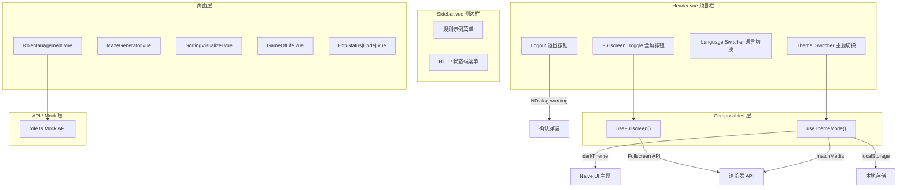

# 技术设计文档：Dashboard 功能增强

## 概述

本设计文档描述 Admin Dashboard 后台管理系统的六项功能增强的技术实现方案。所有功能基于现有技术栈（Vue 3 + TypeScript + Vite 8 + Naive UI + Pinia + vue-i18n + Axios）实现，遵循项目已有的代码规范和目录结构。

### 功能范围

| 编号 | 功能 | 核心变更 |
|------|------|----------|
| 1 | 全屏切换 | 新增 `useFullscreen` composable + Header 按钮 |
| 2 | 暗黑模式切换 | 新增 `useThemeMode` composable + Header 下拉菜单 + App.vue 主题集成 |
| 3 | 退出登录确认 | Header 退出按钮增加 NDialog 确认弹窗 |
| 4 | 角色管理 CRUD | 重构 RoleManagement.vue + 新增 Mock API + 表单/权限弹窗 |
| 5 | 规则示例菜单 | 新增 3 个算法可视化页面 + 路由 + 菜单项 |
| 6 | HTTP 状态码页面 | 新增 11 个状态码展示页面 + 路由 + 菜单项 |

### 设计原则

- **最小侵入**：尽量通过新增文件实现功能，减少对现有文件的修改
- **复用现有模式**：composable 遵循 `useLoading` 等已有 hook 的风格；Mock API 遵循 `src/api/mock/` 的模式
- **国际化优先**：所有用户可见文本通过 `vue-i18n` 语言包管理
- **组件化**：算法可视化页面的核心逻辑与渲染分离，便于测试

## 架构

### 整体架构图



### 文件结构变更

```
src/
├── composables/
│   ├── useFullscreen.ts          # 新增：全屏状态管理
│   └── useThemeMode.ts           # 新增：主题模式管理
├── api/
│   ├── mock/
│   │   └── role.ts               # 新增：角色 CRUD Mock 数据
│   └── index.ts                  # 修改：新增角色 API 导出
├── layouts/
│   ├── Header.vue                # 修改：集成全屏、主题、退出确认
│   ├── Sidebar.vue               # 修改：新增规则示例和 HTTP 状态码菜单
│   └── AdminLayout.vue           # 修改：新增路由映射、集成主题
├── views/
│   ├── system/
│   │   └── RoleManagement.vue    # 重构：完整 CRUD 交互
│   ├── rules/                    # 新增目录
│   │   ├── MazeGenerator.vue     # 新增：迷宫生成与求解
│   │   ├── SortingVisualizer.vue # 新增：排序可视化
│   │   └── GameOfLife.vue        # 新增：生命游戏
│   └── http-status/              # 新增目录
│       ├── HttpStatusPage.vue    # 新增：通用状态码页面组件
│       └── httpStatusConfig.ts   # 新增：状态码配置数据
├── router/
│   └── dynamic-routes.ts         # 修改：新增路由配置
├── types/
│   └── index.ts                  # 修改：新增角色相关类型
├── locales/
│   ├── zh-CN.ts                  # 修改：新增中文文本
│   └── en-US.ts                  # 修改：新增英文文本
└── App.vue                       # 修改：集成 useThemeMode 主题
```

## 组件与接口

### 1. useFullscreen Composable

**文件**: `src/composables/useFullscreen.ts`

```typescript
interface UseFullscreenReturn {
  /** 当前是否处于全屏状态 */
  isFullscreen: Ref<boolean>
  /** 切换全屏状态 */
  toggleFullscreen: () => Promise<void>
}

export function useFullscreen(): UseFullscreenReturn
```

**实现要点**：
- 使用 `ref<boolean>` 跟踪全屏状态，初始值通过 `!!document.fullscreenElement` 获取
- `toggleFullscreen` 根据当前状态调用 `document.documentElement.requestFullscreen()` 或 `document.exitFullscreen()`
- 通过 `useEventListener`（已有 composable）监听 `fullscreenchange` 事件同步状态
- 组件卸载时自动清理事件监听（`onUnmounted`）

### 2. useThemeMode Composable

**文件**: `src/composables/useThemeMode.ts`

```typescript
type ThemeMode = 'light' | 'dark' | 'system'

interface UseThemeModeReturn {
  /** 用户选择的主题模式 */
  themeMode: Ref<ThemeMode>
  /** 设置主题模式 */
  setThemeMode: (mode: ThemeMode) => void
  /** 计算后的 Naive UI 主题对象，light 返回 null，dark 返回 darkTheme */
  naiveTheme: ComputedRef<GlobalTheme | null>
}

export function useThemeMode(): UseThemeModeReturn
```

**实现要点**：
- `themeMode` 初始值从 `localStorage.getItem('themeMode')` 读取，默认 `'light'`
- `setThemeMode` 更新 `themeMode` 并写入 `localStorage`
- `naiveTheme` 为计算属性：
  - `'light'` → `null`
  - `'dark'` → `darkTheme`（从 naive-ui 导入）
  - `'system'` → 根据 `window.matchMedia('(prefers-color-scheme: dark)').matches` 决定
- 当 `themeMode === 'system'` 时，通过 `matchMedia.addEventListener('change', ...)` 监听系统主题变化
- 同时维护一个内部 `systemPrefersDark: Ref<boolean>` 响应式变量，供 `naiveTheme` 计算使用

**集成方式**：在 `App.vue` 中使用 `<NConfigProvider :theme="naiveTheme">` 包裹应用根组件。

### 3. Header.vue 修改

**变更内容**：

1. **全屏按钮**：在语言切换器左侧添加 `NButton`，tooltip 显示全屏状态文字，点击调用 `toggleFullscreen()`
2. **主题切换下拉菜单**：在全屏按钮左侧添加 `NDropdown`，三个选项对应三种模式，图标随当前模式变化
3. **退出确认弹窗**：将 `handleLogout` 改为先调用 `NDialog.warning()` 弹出确认框，确认后再执行原有退出逻辑

**右侧操作区域布局顺序**（从左到右）：
`用户名` → `主题切换` → `全屏按钮` → `语言切换` → `退出登录`

### 4. 角色管理 CRUD

#### 4.1 角色 Mock API

**文件**: `src/api/mock/role.ts`

```typescript
interface RoleItem {
  id: number
  name: string
  code: string
  description: string
  status: 'enabled' | 'disabled'
  permCount: number
  userCount: number
  permissions: string[]
  createTime: string
}

/** 获取角色列表 */
export function handleRoleListMock(): MockResponse<RoleItem[]>

/** 新增角色 */
export function handleRoleCreateMock(body: object): MockResponse<RoleItem>

/** 编辑角色 */
export function handleRoleUpdateMock(body: object): MockResponse<null>

/** 删除角色 */
export function handleRoleDeleteMock(id: number): MockResponse<null>

/** 更新角色权限 */
export function handleRolePermissionMock(body: object): MockResponse<null>
```

**设计决策**：Mock 数据使用内存数组存储，支持运行时增删改，页面刷新后重置。这与项目现有 Mock 模式一致（参考 `src/api/mock/auth.ts`）。

#### 4.2 API 层导出

**文件**: `src/api/index.ts` 新增导出：

```typescript
export async function apiGetRoles(): Promise<MockResponse<RoleItem[]>>
export async function apiCreateRole(data: Partial<RoleItem>): Promise<MockResponse<RoleItem>>
export async function apiUpdateRole(data: Partial<RoleItem>): Promise<MockResponse<null>>
export async function apiDeleteRole(id: number): Promise<MockResponse<null>>
export async function apiUpdateRolePermission(roleId: number, permissions: string[]): Promise<MockResponse<null>>
```

#### 4.3 RoleManagement.vue 重构

**组件结构**：

```
RoleManagement.vue
├── 页面标题 + 添加按钮
├── NDataTable（角色列表，从 API 加载）
├── NModal（角色表单弹窗 - 新增/编辑共用）
│   └── NForm（角色名称、角色标识、描述、状态）
├── NModal（权限配置弹窗）
│   └── NTree（权限树形选择）
└── NDialog（删除确认 - 通过 useDialog 调用）
```

**状态管理**：
- 使用 `useLoading`（已有 composable）管理表格加载状态
- 表单弹窗通过 `showFormModal: Ref<boolean>` 和 `editingRole: Ref<RoleItem | null>` 控制
- 权限弹窗通过 `showPermModal: Ref<boolean>` 和 `currentRole: Ref<RoleItem | null>` 控制
- 表单验证使用 Naive UI `NForm` 的 `rules` 属性

### 5. 规则示例页面

#### 5.1 迷宫生成与求解（MazeGenerator.vue）

**架构**：将算法逻辑与渲染分离。

```
MazeGenerator.vue（页面组件）
├── 控制面板（算法选择、尺寸、速度）
└── Canvas 渲染区域

核心逻辑（纯函数，可测试）：
├── mazeAlgorithms.ts
│   ├── generateMazeRecursiveBacktrack(rows, cols) → MazeGrid
│   └── generateMazePrim(rows, cols) → MazeGrid
└── mazeSolvers.ts
    ├── solveBFS(maze, start, end) → Path
    └── solveDFS(maze, start, end) → Path
```

**数据结构**：
```typescript
type CellType = 'wall' | 'passage' | 'start' | 'end' | 'path' | 'visited'

interface MazeGrid {
  rows: number
  cols: number
  cells: CellType[][]
}

interface MazeStep {
  row: number
  col: number
  type: CellType
}
```

**动画机制**：算法函数以生成器（Generator）形式实现，每次 `yield` 一个 `MazeStep`，由页面组件通过 `requestAnimationFrame` + 速度控制逐步消费并渲染到 Canvas。

**渲染方案**：使用 Canvas API，每个单元格为固定像素大小的矩形，不同 `CellType` 对应不同颜色。

#### 5.2 排序可视化（SortingVisualizer.vue）

**架构**：

```
SortingVisualizer.vue（页面组件）
├── 控制面板（算法选择、数组大小、速度）
└── Canvas 柱状图渲染区域

核心逻辑（纯函数，可测试）：
└── sortAlgorithms.ts
    ├── bubbleSort(arr) → Generator<SortStep>
    ├── quickSort(arr) → Generator<SortStep>
    ├── mergeSort(arr) → Generator<SortStep>
    └── insertionSort(arr) → Generator<SortStep>
```

**数据结构**：
```typescript
interface SortStep {
  array: number[]
  comparing: [number, number]  // 当前比较的两个索引
  swapping: [number, number] | null  // 当前交换的两个索引
}
```

#### 5.3 生命游戏（GameOfLife.vue）

**架构**：

```
GameOfLife.vue（页面组件）
├── 控制面板（开始/暂停/单步/重置/预设模式/速度）
└── Canvas 网格渲染区域

核心逻辑（纯函数，可测试）：
└── gameOfLife.ts
    ├── nextGeneration(grid) → Grid
    ├── countNeighbors(grid, row, col) → number
    └── presets: Record<string, Grid>  // 预设图案
```

**数据结构**：
```typescript
type Grid = boolean[][]  // true = 存活, false = 死亡

interface GameOfLifePreset {
  name: string
  pattern: Grid
  offset: { row: number; col: number }
}
```

**生命游戏规则**（Conway's Game of Life）：
1. 存活细胞邻居数 < 2 → 死亡（孤独）
2. 存活细胞邻居数 = 2 或 3 → 存活
3. 存活细胞邻居数 > 3 → 死亡（拥挤）
4. 死亡细胞邻居数 = 3 → 复活

### 6. HTTP 状态码页面

**设计决策**：使用单一通用组件 `HttpStatusPage.vue` + 配置数据驱动，而非为每个状态码创建独立 `.vue` 文件。这减少了代码重复，新增状态码只需添加配置。

**文件**: `src/views/http-status/httpStatusConfig.ts`

```typescript
interface HttpStatusConfig {
  code: number
  name: string          // 如 "OK", "Not Found"
  i18nKey: string       // 国际化 key 前缀
  type: 'success' | 'info' | 'warning' | 'error'
  showReLoginButton?: boolean
  showBackHomeButton?: boolean
}

export const httpStatusConfigs: HttpStatusConfig[]
```

**文件**: `src/views/http-status/HttpStatusPage.vue`

通过路由参数 `:code` 获取当前状态码，从配置中查找对应数据，使用 Naive UI `NResult` 组件渲染。视觉风格与现有 Error401/403/404/500 页面保持一致。

**路由配置**：使用动态路由参数 `/permission/http-:code`，在组件内根据 `route.params.code` 查找配置。

### 7. 路由配置

在 `src/router/dynamic-routes.ts` 中新增：

```typescript
// 规则示例路由
{ path: 'rules/maze', name: 'MazeGenerator', component: () => import('@/views/rules/MazeGenerator.vue') }
{ path: 'rules/sorting', name: 'SortingVisualizer', component: () => import('@/views/rules/SortingVisualizer.vue') }
{ path: 'rules/game-of-life', name: 'GameOfLife', component: () => import('@/views/rules/GameOfLife.vue') }

// HTTP 状态码路由（动态参数）
{ path: 'permission/http-:code', name: 'HttpStatus', component: () => import('@/views/http-status/HttpStatusPage.vue') }
```

### 8. 国际化扩展

在 `zh-CN.ts` 和 `en-US.ts` 中新增以下 key 分组：

```typescript
// header 扩展
header: {
  fullscreen: '全屏',
  exitFullscreen: '退出全屏',
  themeLight: '亮色模式',
  themeDark: '暗色模式',
  themeSystem: '跟随系统',
  logoutConfirm: '确定要退出登录吗？',
}

// 角色管理
role: {
  addRole: '新增角色',
  editRole: '编辑角色',
  roleName: '角色名称',
  roleCode: '角色标识',
  description: '描述',
  status: '状态',
  enabled: '启用',
  disabled: '禁用',
  permissions: '权限配置',
  deleteConfirm: '确定要删除角色 "{name}" 吗？',
  nameRequired: '请输入角色名称',
  codeRequired: '请输入角色标识',
}

// 规则示例
rules: {
  title: '规则示例',
  maze: '迷宫生成与求解',
  sorting: '排序可视化',
  gameOfLife: '生命游戏',
  generate: '生成迷宫',
  solve: '求解迷宫',
  // ... 更多控制标签
}

// HTTP 状态码
httpStatus: {
  title: 'HTTP 状态码',
  '200': { name: 'OK', description: '请求成功' },
  '204': { name: 'No Content', description: '请求成功但无返回内容' },
  // ... 其他状态码
}
```

## 数据模型

### 角色数据模型

```typescript
/** 角色实体 */
interface RoleItem {
  id: number
  name: string           // 角色名称，如"管理员"
  code: string           // 角色标识，如"admin"
  description: string    // 角色描述
  status: 'enabled' | 'disabled'
  permCount: number      // 权限数量
  userCount: number      // 关联用户数
  permissions: string[]  // 权限标识列表
  createTime: string     // 创建时间，格式 "YYYY-MM-DD"
}

/** 角色表单数据（新增/编辑） */
interface RoleFormData {
  name: string
  code: string
  description: string
  status: 'enabled' | 'disabled'
}
```

### 主题模式数据模型

```typescript
type ThemeMode = 'light' | 'dark' | 'system'

// localStorage key: 'themeMode'
// localStorage value: ThemeMode
```

### 迷宫数据模型

```typescript
type CellType = 'wall' | 'passage' | 'start' | 'end' | 'path' | 'visited'

interface MazeGrid {
  rows: number
  cols: number
  cells: CellType[][]
}

interface MazeStep {
  row: number
  col: number
  type: CellType
}

type MazeAlgorithm = 'recursive-backtrack' | 'prim'
type SolveAlgorithm = 'bfs' | 'dfs'
```

### 排序数据模型

```typescript
interface SortStep {
  array: number[]
  comparing: [number, number]
  swapping: [number, number] | null
}

type SortAlgorithm = 'bubble' | 'quick' | 'merge' | 'insertion'
```

### 生命游戏数据模型

```typescript
type Grid = boolean[][]

interface GameOfLifePreset {
  name: string
  i18nKey: string
  pattern: boolean[][]
  offset: { row: number; col: number }
}
```

### HTTP 状态码配置模型

```typescript
interface HttpStatusConfig {
  code: number
  name: string
  i18nKey: string
  type: 'success' | 'info' | 'warning' | 'error'
  showReLoginButton?: boolean
  showBackHomeButton?: boolean
}
```


## 正确性属性（Correctness Properties）

*属性（Property）是指在系统所有有效执行中都应成立的特征或行为——本质上是对系统应做什么的形式化陈述。属性是人类可读规范与机器可验证正确性保证之间的桥梁。*

本功能集中，算法可视化模块（迷宫生成/求解、排序算法、生命游戏）包含大量纯函数逻辑，非常适合属性基测试（Property-Based Testing）。而 UI 交互、CRUD 操作、主题切换等功能更适合示例基测试。

### Property 1: 迷宫生成有效性

*For any* 有效的行数 rows（奇数，≥ 5）和列数 cols（奇数，≥ 5），以及任意迷宫生成算法（递归回溯法或 Prim 算法），生成的迷宫网格应满足：(1) 网格尺寸为 rows × cols，(2) 存在且仅存在一个起点和一个终点，(3) 起点和终点之间存在至少一条通路（通过 BFS 可达性验证）。

**Validates: Requirements 5.4**

### Property 2: 迷宫求解正确性

*For any* 由生成算法产生的有效迷宫，以及任意求解算法（BFS 或 DFS），求解返回的路径应满足：(1) 路径起始于迷宫起点，(2) 路径终止于迷宫终点，(3) 路径中每一步都是相邻的通道单元格（非墙壁），(4) 路径中无重复单元格。

**Validates: Requirements 5.5**

### Property 3: 排序算法正确性

*For any* 数字数组和任意排序算法（冒泡排序、快速排序、归并排序或插入排序），执行排序后的最终数组应满足：(1) 数组元素单调非递减（有序性），(2) 排序后的数组是原数组的排列（元素集合不变性，即包含相同的元素和相同的出现次数）。

**Validates: Requirements 5.11**

### Property 4: 单元格切换自反性（Round-Trip）

*For any* 有效的生命游戏网格和任意有效坐标 (row, col)，对该坐标执行两次 toggle 操作后，网格应恢复到初始状态。即 `toggleCell(toggleCell(grid, row, col), row, col) === grid`。

**Validates: Requirements 5.16**

### Property 5: 生命游戏演化规则正确性

*For any* 生命游戏网格状态，`nextGeneration(grid)` 的结果中每个单元格应严格遵循 Conway 规则：(1) 对于结果中任意存活的单元格，要么它在原网格中存活且邻居数为 2 或 3，要么它在原网格中死亡且邻居数恰好为 3；(2) 对于结果中任意死亡的单元格，要么它在原网格中存活且邻居数 < 2 或 > 3，要么它在原网格中死亡且邻居数 ≠ 3。

**Validates: Requirements 5.17**

## 错误处理

### 全屏切换错误处理

| 场景 | 处理方式 |
|------|----------|
| 浏览器不支持 Fullscreen API | `useFullscreen` 检测 `document.fullscreenEnabled`，不支持时 `toggleFullscreen` 静默失败，按钮可选择性隐藏 |
| `requestFullscreen` 被浏览器拒绝（如非用户手势触发） | catch Promise rejection，通过 console.warn 记录，不影响用户体验 |

### 主题切换错误处理

| 场景 | 处理方式 |
|------|----------|
| localStorage 不可用（隐私模式） | try-catch 包裹 localStorage 操作，失败时回退到内存存储，主题仍可切换但不持久化 |
| localStorage 中存储了无效的 themeMode 值 | 读取时校验值是否为 `'light' | 'dark' | 'system'`，无效值回退到 `'light'` |
| `matchMedia` 不可用 | 检测 `window.matchMedia` 是否存在，不存在时 `'system'` 模式回退为 `'light'` |

### 角色管理错误处理

| 场景 | 处理方式 |
|------|----------|
| 角色列表 API 请求失败 | 使用 Naive UI `useMessage` 显示错误通知，表格显示空状态 |
| 新增/编辑角色 API 请求失败 | 弹窗保持打开，显示错误通知，用户可重试 |
| 删除角色 API 请求失败 | 显示错误通知，列表不变 |
| 权限配置 API 请求失败 | 弹窗保持打开，显示错误通知 |
| 表单验证失败（空角色名称/标识） | NForm rules 阻止提交，字段下方显示红色错误提示 |

### 算法可视化错误处理

| 场景 | 处理方式 |
|------|----------|
| Canvas 上下文获取失败 | 显示降级提示文字 |
| 迷宫尺寸过大导致性能问题 | 限制最大尺寸（如 101×101），超出时显示警告 |
| 排序数组过大 | 限制最大数组大小（如 200），超出时显示警告 |
| 动画过程中用户切换页面 | 通过 `onUnmounted` 清理 `requestAnimationFrame` 和定时器，防止内存泄漏 |

### HTTP 状态码页面错误处理

| 场景 | 处理方式 |
|------|----------|
| 路由参数中的状态码不在配置列表中 | 显示通用的"未知状态码"页面，提供返回首页按钮 |

## 测试策略

### 测试框架

项目当前未配置测试框架。建议新增：
- **Vitest**：作为单元测试和属性基测试的运行器（与 Vite 生态无缝集成）
- **fast-check**：作为属性基测试库（TypeScript 原生支持，与 Vitest 集成良好）
- **@vue/test-utils**：Vue 组件测试工具（可选，用于组件级测试）

### 双重测试方法

#### 属性基测试（Property-Based Tests）

适用于算法可视化模块的纯函数逻辑，每个属性测试至少运行 100 次迭代。

| 属性 | 测试文件 | 被测函数 |
|------|----------|----------|
| Property 1: 迷宫生成有效性 | `src/views/rules/__tests__/mazeAlgorithms.prop.test.ts` | `generateMazeRecursiveBacktrack`, `generateMazePrim` |
| Property 2: 迷宫求解正确性 | `src/views/rules/__tests__/mazeSolvers.prop.test.ts` | `solveBFS`, `solveDFS` |
| Property 3: 排序算法正确性 | `src/views/rules/__tests__/sortAlgorithms.prop.test.ts` | `bubbleSort`, `quickSort`, `mergeSort`, `insertionSort` |
| Property 4: 单元格切换自反性 | `src/views/rules/__tests__/gameOfLife.prop.test.ts` | `toggleCell` |
| Property 5: 生命游戏演化规则 | `src/views/rules/__tests__/gameOfLife.prop.test.ts` | `nextGeneration`, `countNeighbors` |

每个属性测试必须包含注释标签：
```typescript
// Feature: dashboard-enhancements, Property 1: 迷宫生成有效性
```

**属性测试配置**：
- 使用 `fast-check` 库
- 每个属性最少 100 次迭代（`fc.assert(property, { numRuns: 100 })`）
- 生成器策略：
  - 迷宫尺寸：奇数整数 5-51
  - 排序数组：长度 0-200 的整数数组
  - 生命游戏网格：5×5 到 30×30 的布尔矩阵

#### 单元测试（Unit Tests）

适用于 composable 逻辑、CRUD 交互、UI 行为等。

| 模块 | 测试文件 | 测试内容 |
|------|----------|----------|
| useFullscreen | `src/composables/__tests__/useFullscreen.test.ts` | 状态切换、事件监听、API 调用 |
| useThemeMode | `src/composables/__tests__/useThemeMode.test.ts` | 模式切换、localStorage 持久化、系统主题检测 |
| 角色 Mock API | `src/api/mock/__tests__/role.test.ts` | CRUD 操作返回值正确性 |
| HTTP 状态码配置 | `src/views/http-status/__tests__/httpStatusConfig.test.ts` | 配置完整性、类型映射正确性 |

### 不适用 PBT 的模块说明

以下模块不使用属性基测试：

- **useFullscreen / useThemeMode**：状态空间有限（全屏开/关、3 种主题模式），示例基测试即可覆盖
- **角色管理 CRUD**：主要是 API 调用和 UI 交互的集成，使用示例基测试 + Mock
- **退出登录确认**：简单的 UI 交互流程，使用示例基测试
- **HTTP 状态码页面**：配置驱动的静态展示，输入空间有限（11 个状态码），使用示例基测试
- **Sidebar / Header UI 变更**：UI 结构验证，使用示例基测试
